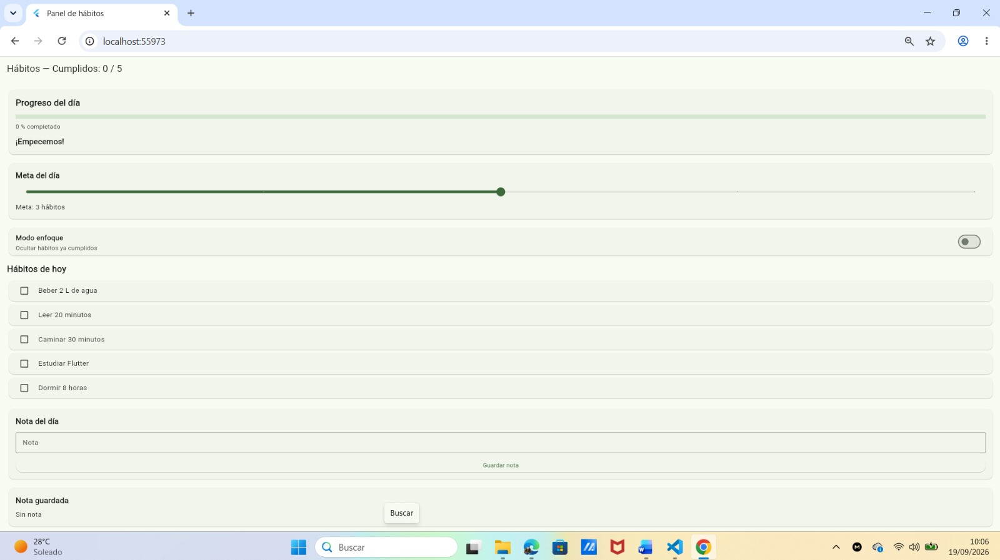
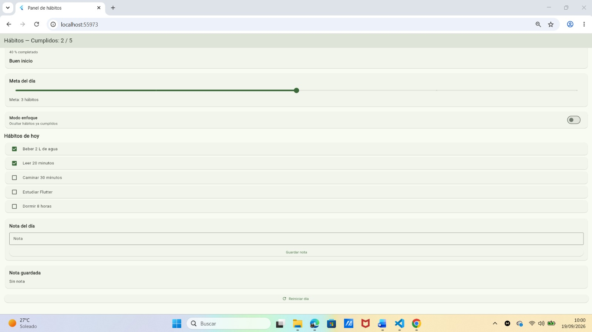
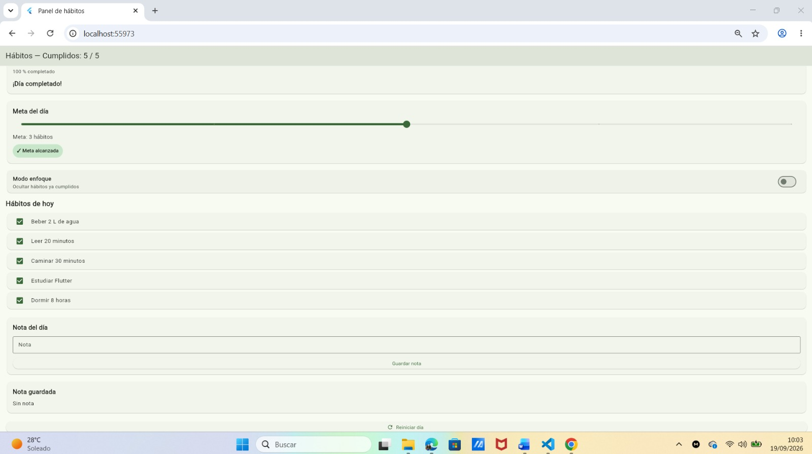
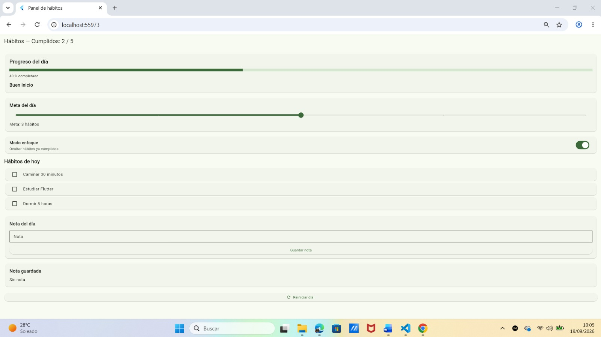

# Panel de hábitos del día

## Descripción de la aplicación

Esta aplicación fue desarrollada en Flutter y permite llevar un control de los hábitos diarios.

La aplicación permite marcar los hábitos cumplidos y visualizar el progreso en tiempo real. También permite establecer una meta diaria mediante un Slider, activar el modo enfoque, agregar una nota del día y reiniciar el progreso.

El proyecto utiliza StatefulWidget y setState() para actualizar la interfaz de acuerdo con las acciones del usuario.

## Tecnologías utilizadas

* Flutter
* Dart
* StatefulWidget
* setState()
* Material Design

## Variables de estado utilizadas

| Variable     | Descripción                                             |
| ------------ | ------------------------------------------------------- |
| `_cumplidos` | Lista que indica cuáles hábitos han sido completados    |
| `_meta`      | Cantidad de hábitos que se desea cumplir durante el día |
| `_enfoque`   | Controla si se ocultan los hábitos completados          |
| `_nota`      | Guarda la nota del día                                  |
| `_notaCtrl`  | Controlador del campo de texto para escribir la nota    |

## Funcionalidades principales

* Mostrar una lista de 5 hábitos diarios.
* Marcar y desmarcar hábitos mediante Checkbox.
* Mostrar el contador de hábitos cumplidos.
* Mostrar una barra de progreso.
* Mostrar mensajes motivacionales según el progreso.
* Establecer una meta diaria mediante un Slider.
* Mostrar un aviso cuando se alcanza la meta.
* Activar el modo enfoque para ocultar los hábitos completados.
* Guardar una nota del día.
* Reiniciar el progreso diario.

## Capturas de pantalla

### 1. Pantalla inicial

La aplicación muestra los hábitos sin completar y el progreso inicial.

### 2. Progreso parcial

Se muestran algunos hábitos completados y el progreso actualizado.

### 3. Día completado

Se muestran todos los hábitos completados y el mensaje de finalización.

### 4. Modo enfoque

El modo enfoque oculta los hábitos que ya fueron completados.

## Reflexión

Durante el desarrollo comprendí la importancia de utilizar setState() para actualizar la interfaz cuando cambia el estado de la aplicación. Un error que podría ocurrir es modificar una variable sin utilizar setState(), lo que impediría que los cambios se reflejaran inmediatamente en la pantalla. Para evitar este problema, las modificaciones del estado se realizan dentro de setState(). También es importante liberar el TextEditingController utilizando dispose().

## Autor

Melvin Gonzalez

## Repositorio

Este proyecto forma parte de la práctica de Flutter sobre el manejo de estados con StatefulWidget y setState().
